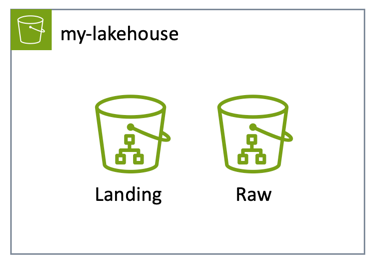

# Building Data Engineering Pipelines on AWS

1. Create AWS S3 Bucket

   Create an S3 Bucket using boto3 SDK. It will be used to store GitHub Activity Data
        
    - Create a new bucket by name : <b>'my-lakehouse'</b>
    - Also create folder for landing and raw zone for my data
   
    - The <b>Landing Zone</b> will be used to ingest data from external sources.
    - Typically, data in the landing zone will be deleted. It will act as a scratch pad, we can delete data that is 
   older than 30 days or as per SLAs
    - The <b>Raw Zone</b> will be used to store data from sources following our data lake standards. In our case we will
   use parquet as target file format and partition all the data on a daily basics.

2. Create IAM Group and User
   
   Create an IAM group as well as User to have access to GitHub Activity data and associated jobs.
